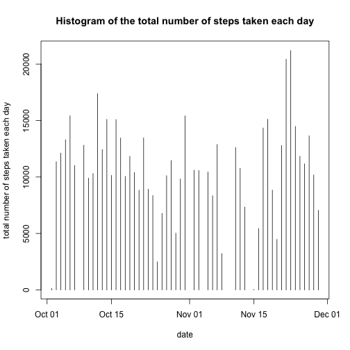
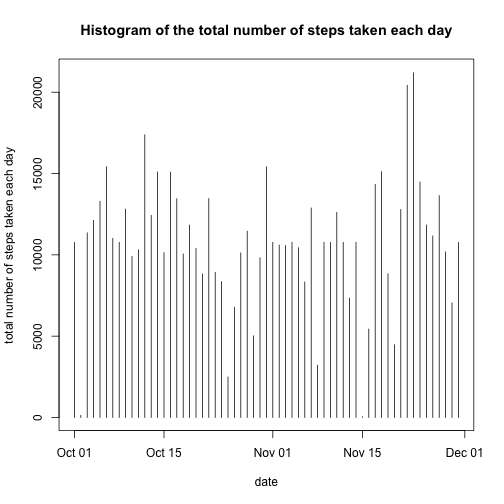
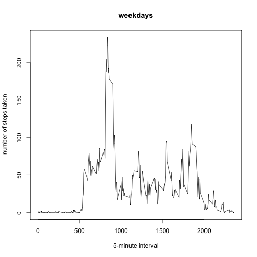
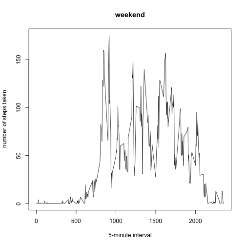

##Loading and preprocessing the data

Code to load the data:


```r
        library(plyr)
        setwd("/Users/tiet/Dropbox (Aspiraclip)/MOOC/Data Scientist/RepData_PeerAssessment1")
        datawithna <- read.csv("activity.csv")
        datawithna$date  <- as.Date(datawithna$date)
        dataclean  <- datawithna[!is.na(datawithna$step),]
```

##What is mean total number of steps taken per day?
###number of steps taken per day:

```r
stepsperday  <- ddply(dataclean, .(date), summarize, steps = sum(steps))
```

###Make a histogram of the total number of steps taken each day

```r
plot(x = stepsperday$date, y=stepsperday$steps,  type = "h", xlab= "date", ylab = "total number of steps taken each day", main = "Histogram of the total number of steps taken each day")
```

 

###Calculate and report the mean and median of the total number of steps taken per day
- mean:

```r
mean(stepsperday$steps)
```

```
## [1] 10766.19
```

- median:

```r
median(stepsperday$steps)
```

```
## [1] 10765
```

##What is the average daily activity pattern?
###Make a time series plot of the 5-minute interval (x-axis) and the average number of steps taken, averaged across all days (y-axis)


```r
stepsperinterval  <- ddply(dataclean, .(interval), summarize, steps = mean(steps))
plot(stepsperinterval$interval, stepsperinterval$steps, type = "l", xlab = "5-minute interval", ylab = "average number of steps taken")
```

 
   
###Which 5-minute interval, on average across all the days in the dataset, contains the maximum number of steps?

the interval with the maximum number of steps on average across all the days in the dataset:

```r
MaxInterval <- stepsperinterval[which.max(stepsperinterval$steps),1]
MaxInterval
```

```
## [1] 835
```


##Imputing missing values
### Total number of missing values in the dataset:


```r
sum(is.na(datawithna$step))
```

```
## [1] 2304
```

###Strategy for filling in all of the missing values in the dataset:

To fill in all the missing values in the dataset the mean mean for that 5-minute interval will be used to replace the missing value.

##Create a new dataset that is equal to the original dataset but with the missing data filled in.


```r
completeddata <- datawithna

for (i in 1:nrow(completeddata)){
    if (is.na(completeddata$steps[i])){
        completeddata$steps[i] <- stepsperinterval$steps[which(completeddata$interval[i] == stepsperinterval$interval)]}
}
```


###Make a histogram of the total number of steps taken each day and Calculate and report the mean and median total number of steps taken per day. 

```r
stepsperdaycompletedset  <- ddply(completeddata, .(date), summarize, steps = sum(steps))
plot(x = stepsperdaycompletedset$date, y=stepsperdaycompletedset$steps,  type = "h", xlab= "date", ylab = "total number of steps taken each day", main = "Histogram of the total number of steps taken each day")
```

 

```r
mean(stepsperdaycompletedset$steps)
```

```
## [1] 10766.19
```

```r
median(stepsperdaycompletedset$steps)
```

```
## [1] 10766.19
```

###Do these values differ from the estimates from the first part of the assignment? 
there is no difference on the Mean and a minimal difference on the median:

```r
mean(stepsperday$steps)-mean(stepsperdaycompletedset$steps)
```

```
## [1] 0
```

```r
median(stepsperday$steps)-median(stepsperdaycompletedset$steps)
```

```
## [1] -1.188679
```

###What is the impact of imputing missing data on the estimates of the total daily number of steps?


```r
sum(completeddata$steps) - sum(dataclean$steps)
```

```
## [1] 86129.51
```
the estimates increase.

##Are there differences in activity patterns between weekdays and weekends?

###Create a new factor variable in the dataset with two levels – “weekday” and “weekend” indicating 
whether a given date is a weekday or weekend day.


```r
isweekday <- function(day){
        ifelse(day == "Saturday" | day == "Sunday",result <- "weekend",result <-  "weekday")
}
dataclean$weekday <- isweekday(weekdays(dataclean$date))
```


###Panel plot containing a time series plot (i.e. type = "l") of the 5-minute interval (x-axis) and the average number of steps taken, averaged across all weekday days or weekend days (y-axis). 

```r
dataweekdays <- dataclean[dataclean$weekday=="weekday",]
stepsperintervalweekdays  <- ddply(dataweekdays, .(interval), summarize, steps = mean(steps))
plot(stepsperintervalweekdays$interval, stepsperintervalweekdays$steps, type = "l", xlab = "5-minute interval", ylab = " number of steps taken", main = "weekdays")
```

 

```r
dataweekend <- dataclean[dataclean$weekday=="weekend",]
stepsperintervalweekend  <- ddply(dataweekend, .(interval), summarize, steps = mean(steps))
plot(stepsperintervalweekend$interval, stepsperintervalweekend$steps, type = "l", xlab = "5-minute interval", ylab = " number of steps taken", main = "weekend")
```

 

